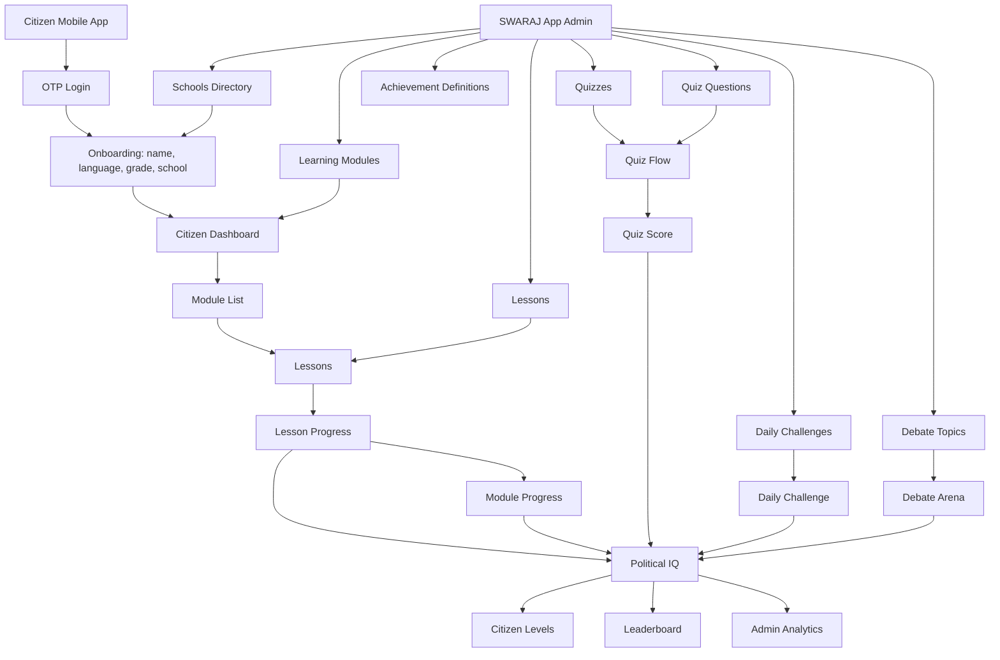
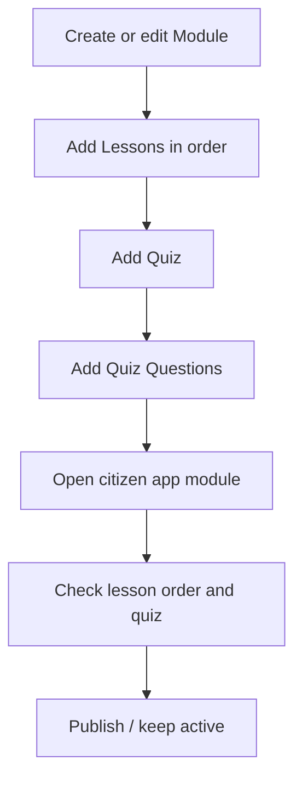
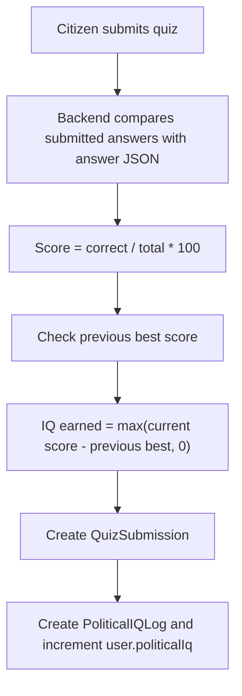
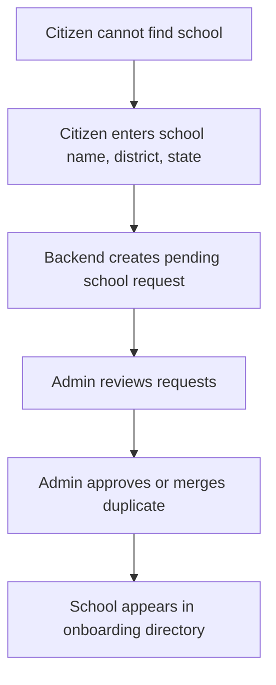

# SWARAJ Product Flow And Runbook

This document explains the SWARAJ product model, how each app area connects, how to run the system locally, and how Political IQ, levels, achievements, certificates, and admin operations work.

## Product Model

SWARAJ is a citizen-facing civic learning app. It is not a school-owned admin system. Citizens use the mobile app directly, complete onboarding, select or provide their school information, learn civic modules, attempt quizzes, join challenges and debates, and build a Political IQ profile.

The admin portal is the SWARAJ app admin. It should stay sober, simple, and operational. The admin is used to keep content updated and monitor app activity, not to behave like a heavy school ERP.

| Role | What They Do | Product Meaning |
|---|---|---|
| Citizen / user | Signs in, completes onboarding, selects school, learns modules, attempts quizzes, completes challenges/debates, views profile and certificate status. | Primary user of the app. |
| SWARAJ app admin | Maintains schools, modules, lessons, quizzes, challenge topics, debate topics, achievements, and analytics. | Internal content and operations user. |
| Backend API | Stores content, citizen progress, scoring, auth, and admin operations. | Source of truth for all app and admin data. |

## High-Level System Flow



## Run Everything Locally

### Prerequisites

| Requirement | Why |
|---|---|
| Node.js 20.9+ | Backend/admin workspace. |
| pnpm 11.x | Monorepo package manager. |
| PostgreSQL | Main database. |
| Redis | Available infra dependency. |
| Flutter 3.x | Mobile app. |
| Android Studio / emulator | Android testing. |

### 1. Install And Configure

```bash
cd swaraj-client
cp .env.example .env
pnpm install
```

Set required environment values in `.env`, especially:

| Env | Purpose |
|---|---|
| `DATABASE_URL` | PostgreSQL connection. |
| `JWT_ACCESS_SECRET` | Access token signing. |
| `JWT_REFRESH_SECRET` | Refresh token signing. |
| `ADMIN_ORIGIN` | Admin CORS origin, usually `http://localhost:3000`. |
| `OPENAI_API_KEY` | Required only if AI explain is enabled. |
| `OTP_PROVIDER`, `MSG91_AUTH_KEY`, `MSG91_TEMPLATE_ID` | Required for production OTP. |

### 2. Start Database

```bash
docker compose up -d postgres redis
```

### 3. Prepare Backend Database

```bash
pnpm --filter @swaraj/backend prisma:generate
pnpm db:migrate
pnpm db:seed
```

Seed admin:

```text
Email: admin@swaraj.local
Password: ChangeMe123!
```

### 4. Run Backend

```bash
pnpm dev:backend
```

Backend runs at:

```text
http://localhost:4000/api
```

Swagger runs at:

```text
http://localhost:4000/api/docs
```

### 5. Run Admin Portal

```bash
pnpm dev:admin
```

Admin runs at:

```text
http://localhost:3000
```

### 6. Run Mobile App

For iOS simulator or browser-like local network:

```bash
cd apps/mobile
flutter pub get
flutter run --dart-define=API_URL=http://localhost:4000/api
```

For Android emulator:

```bash
cd apps/mobile
flutter run --dart-define=API_URL=http://10.0.2.2:4000/api
```

## Citizen App Flow

| Step | Citizen Action | Screen / Feature | Backend API | Result |
|---|---|---|---|---|
| 1 | Opens app | Splash | Local session check | Sends user to auth/onboarding/dashboard. |
| 2 | Enters phone | Auth | `POST /auth/send-otp` | OTP challenge is created. |
| 3 | Verifies OTP | Auth | `POST /auth/verify-otp` | Access/refresh tokens saved. |
| 4 | Enters profile | Onboarding | `GET /schools`, `PATCH /me/profile` | Name, language, grade, school saved. |
| 5 | Views progress | Dashboard | `GET /dashboard` | Shows Political IQ, level, streak, rank, next module. |
| 6 | Browses content | Modules | `GET /modules` | Shows available learning modules. |
| 7 | Opens module | Module detail | `GET /modules/:id` | Shows lessons and quizzes. |
| 8 | Completes lesson | Lesson | `POST /lessons/:id/complete` | Adds lesson progress and possible module completion. |
| 9 | Attempts quiz | Quiz | `POST /quiz/submit` | Stores score, awards improvement-based IQ. |
| 10 | Completes challenge | Daily Challenge | `GET /daily-challenge`, `POST /daily-challenge/submit` | Stores challenge result and updates streak. |
| 11 | Joins debate | Debate | `GET /debate/current`, `POST /debate/respond` | Stores reflection and awards debate IQ. |
| 12 | Views leaderboard | Leaderboard | `GET /leaderboard` | Shows ranking within school context. |
| 13 | Views profile | Profile | `GET /me` | Shows profile, Political IQ, level. |
| 14 | Checks certificate | Certificate | `GET /certificate/status`, `GET /certificate/download` | Shows eligibility or generates certificate. |
| 15 | Asks AI | AI Explain | `POST /ai/explain` | Returns simplified civic explanation. |

## Admin Portal Flow

The admin portal should stay simple:

- One sober sidebar.
- Clear tables.
- Short forms.
- Easy content update flow.
- No heavy school ERP workflows.
- No nested complex configuration screens unless required for Phase 2.

| Admin Area | What Admin Manages | Citizen App Impact |
|---|---|---|
| Dashboard | App-level analytics and activity health. | Reflects citizen activity and content completion. |
| Students | Citizen accounts and basic records. | Shows who is using the app. |
| Schools | School directory used during onboarding. | Citizens select school from this list. |
| Modules | Top-level learning units. | Citizens see these in module list. |
| Lessons | Reading content inside modules. | Citizens read and complete lessons. |
| Quizzes | Quiz containers attached to modules. | Citizens attempt quizzes. |
| Quiz Questions | Prompts, options, answers, explanations. | Citizens answer these in quiz screen. |
| Challenges | Daily challenge questions. | Citizens complete daily challenge. |
| Debates | Active civic debate topic. | Citizens submit FOR/AGAINST reflection. |
| Achievements | Badge definitions. | Backend awards badges when conditions are met. |
| Leaderboard | App ranking view. | Mirrors citizen leaderboard behavior. |
| Certificates | Issued certificate records. | Mirrors citizen certificate flow. |
| Exports | Operational counts. | Admin-only reporting. |

## Easy Module Update Workflow

The app admin should update content in this order:



| Step | Admin Action | Keep It Simple |
|---|---|---|
| 1 | Create module with slug, English/Hindi title, description, order, estimated minutes. | One module form. No advanced settings. |
| 2 | Add lessons with module id, order, title, body, type. | Keep lesson type mostly `TEXT` for MVP. |
| 3 | Add quiz attached to module. | One quiz per module is enough for MVP. |
| 4 | Add questions with options and answer JSON. | Admin now has quiz/module dropdowns, question type dropdowns, and JSON examples; a full guided visual question editor remains a future improvement. |
| 5 | Test in citizen app. | Confirm module appears, lessons open, quiz submits. |

Current technical note: quiz options, answers, and daily challenge questions still use JSON fields, but the admin now shows examples, helper text, and dropdowns for related modules/quizzes/categories. A paid improvement should convert this into a full MCQ/True-False/Match builder UI.

## Political IQ And Points

The backend is the source of truth for scoring. The mobile app should display scores, not calculate final Political IQ locally.

### Point Rules

Defined in `packages/shared-utils/src/index.ts` and awarded by backend services.

| Action | Points | Backend Location | Notes |
|---|---:|---|---|
| Complete a lesson | 10 | `LearningService.completeLesson` | Awarded once per lesson using `PoliticalIQLog` check. |
| Complete a full module | 50 | `LearningService.completeLesson` | Awarded when all lessons in module are completed. |
| Quiz score improvement | Variable | `QuizService.submit` | IQ earned = current score minus previous best score. If no improvement, 0. |
| Daily challenge participation | 20 | `DailyChallengeService.submit` | Awarded after first valid submission. |
| Perfect daily challenge | +20 | `DailyChallengeService.submit` | Added when all answers are correct. |
| Debate participation | 35 | `DebateService.respond` | Awarded once per active debate response. |
| Streak milestone | 25 configured | `shared-utils` only | Constant exists, but current service does not award this yet. |

### Quiz Scoring



Example:

| Attempt | Score | Previous Best | IQ Earned |
|---:|---:|---:|---:|
| 1 | 60 | 0 | 60 |
| 2 | 80 | 60 | 20 |
| 3 | 70 | 80 | 0 |

Quiz attempt limit: 3 submissions per quiz.

### Daily Challenge Scoring

| Result | Points |
|---|---:|
| Submitted challenge | 20 |
| Submitted and all answers correct | 40 total |

Daily challenge also updates `streakCount`:

- If last challenge was yesterday, streak increases by 1.
- Otherwise streak resets to 1.

### Levels

Defined in `packages/shared-utils/src/index.ts`.

| Level | Minimum Political IQ |
|---|---:|
| Citizen | 0 |
| Volunteer | 250 |
| Leader | 700 |
| Young Minister | 1200 |

### Achievement Rules

Evaluated in `GamificationService.evaluateAchievements`.

| Achievement Code | Condition |
|---|---|
| `CONSTITUTION_MASTER` | Citizen completes at least 1 module. |
| `DEBATE_CHAMPION` | Citizen completes at least 1 debate. |
| `CIVIC_HERO` | Citizen completes at least 1 daily challenge. |
| `DEMOCRACY_DEFENDER` | Citizen completes at least 3 modules, 1 debate, and 1 challenge. |

Achievement definitions must exist in the `Achievement` table for awards to appear.

## Certificate Logic

Implemented in `CertificateService`.

| Requirement | Rule |
|---|---|
| Modules | Completed modules must be greater than or equal to total active modules. |
| Challenges | At least 1 daily challenge submission. |
| Debates | At least 1 debate response. |

If eligible, `/certificate/download` generates a PDF certificate and stores it using the configured storage driver.

## School Data Model Clarification

The admin is not a school admin. It is the SWARAJ app admin.

Current code behavior:

| Current Behavior | File / API |
|---|---|
| Admin maintains school list. | `/admin/schools` |
| Citizen selects a school during onboarding. | `GET /schools`, `PATCH /me/profile` |
| Leaderboard can rank users within school context. | `GET /leaderboard` |

Product direction requested:

| Requirement | Implementation Note |
|---|---|
| Citizens should be able to provide school details directly. | Add a "request/add my school" flow in onboarding. |
| Admin should review or curate submitted school details. | Add `SchoolRequest` model or allow pending schools. |
| Admin remains app-level, not school-level. | Do not create school admin roles for MVP. |

Suggested future school upload flow:



## MVP Scope Recommendation

For a sober, simple MVP:

| Keep | Reason |
|---|---|
| Auth and onboarding | Required for citizen identity. |
| School selection / school request | Required for citizen school details. |
| Modules and lessons | Core app value. |
| Basic quiz | Core learning check. |
| Basic dashboard and profile | Shows progress and motivation. |
| Simple app admin | Needed for content maintenance. |

Keep for Phase 2 or paid upgrade:

| Feature | Why |
|---|---|
| AI explain | Adds API cost and safety review. |
| Debates | Needs moderation for citizen-written text. |
| Daily challenges | Adds scheduling and streak operations. |
| Certificates | Requires storage, PDF polish, and eligibility QA. |
| Leaderboards | Adds privacy and ranking concerns. |
| Advanced analytics/exports | Enterprise scope. |

## Team Notes

- Keep the admin portal clean and operational.
- Avoid complex nested cards and heavy dashboards.
- Make module and lesson update forms easy for non-technical operators.
- Treat backend as the source of truth for Political IQ, achievements, certificates, and completion.
- Do not calculate final scores in the mobile app.
- For citizens adding school details, add a pending-review workflow instead of making every citizen-created school immediately public.
