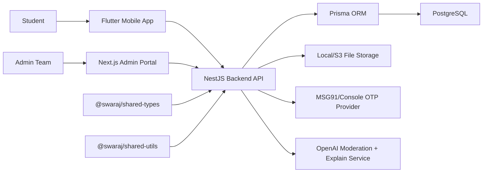
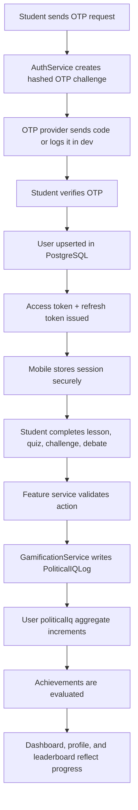
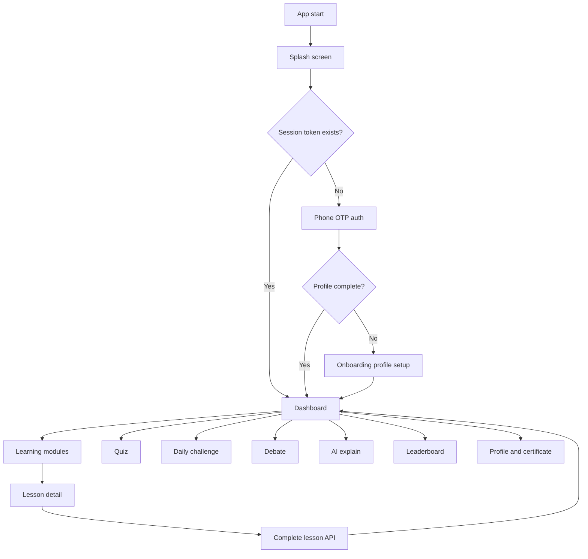
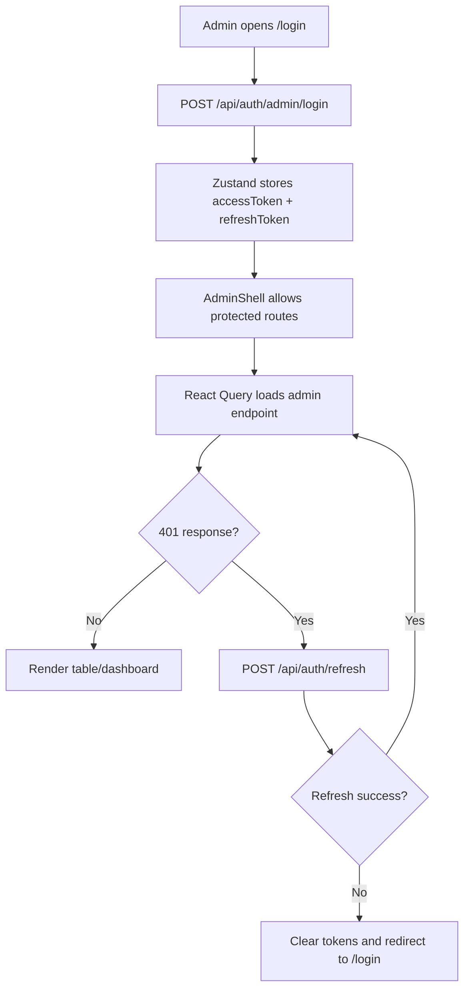
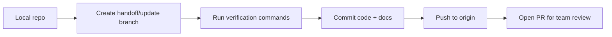

# SWARAJ Team Handoff

This file is the single handoff guide for the `Tarqa-Ai/swaraj-client` repository. It explains what is in the repo, how the parts fit together, what has already been scaffolded, and what the team needs to wire next.

## Repository Purpose

SWARAJ is a civic learning platform for Indian students in Grades 9-12. The repo is structured as a monorepo with:

- Flutter mobile app for students.
- NestJS backend API for auth, learning, quizzes, challenges, debates, AI explain, leaderboards, certificates, storage, and admin operations.
- Next.js admin portal for school/content/analytics management.
- Shared TypeScript packages for common types and scoring utilities.
- Docker Compose and CI for team setup and verification.

Target remote:

```bash
git remote -v
# origin https://github.com/Tarqa-Ai/swaraj-client.git
```

## High-Level Architecture



## Apps And Packages

| Path | Purpose | Owner Area |
| --- | --- | --- |
| `apps/mobile` | Flutter student app with onboarding, auth, dashboard, learning, quiz, challenges, debate, AI, leaderboard, profile, and certificate screens. | Mobile |
| `apps/backend` | NestJS REST API. This is the source of truth for business rules and data. | Backend |
| `apps/admin` | Next.js admin portal for school/content/analytics management. | Admin web |
| `packages/shared-types` | Shared TypeScript API/domain types. | Shared |
| `packages/shared-utils` | Shared scoring, Political IQ, pagination, and badge utilities. | Shared |
| `docs` | Architecture, API, security, and this handoff guide. | Product/engineering |

## Backend Modules

The backend is modular. Each module has controller/service/schema files where applicable.

| Module | Main Files | Responsibility |
| --- | --- | --- |
| Auth | `src/auth/*` | Student OTP login, admin login, access/refresh tokens, logout. |
| Profile | `src/profile/*` | Student profile, school list, onboarding profile completion. |
| Learning | `src/learning/*` | Dashboard summary, modules, lessons, lesson completion. |
| Quiz | `src/quiz/*` | Quiz submission, scoring, attempt limits, score improvement points. |
| Daily Challenge | `src/daily-challenge/*` | Current daily challenge, submissions, history, streaks. |
| Debate | `src/debate/*` | Active debate, student response, debate participation points. |
| AI | `src/ai/*` | Moderated civics explanation using OpenAI. |
| Gamification | `src/gamification/*` | Political IQ award logs, aggregate score updates, achievements. |
| Leaderboard | `src/leaderboard/*` | School leaderboard and student ranks. |
| Certificate | `src/certificate/*` | Eligibility, PDF generation, certificate verification. |
| Admin | `src/admin/*` | Admin analytics and CRUD for schools, modules, lessons, quizzes, challenges, debates, achievements. |
| Storage | `src/storage/*` | Local/S3-compatible file storage service. |

## Backend Data Flow



## Mobile App Components

The Flutter app is feature-first and uses Riverpod/Dio/Hive in the current repo.

| Area | Files | Responsibility |
| --- | --- | --- |
| App entry | `lib/main.dart` | ProviderScope, localization, theme, router boot. |
| Routing | `lib/core/router/app_router.dart` | Routes for splash, auth, onboarding, dashboard, modules, quiz, challenge, debate, AI, leaderboard, profile, certificate. |
| API client | `lib/core/api/api_client.dart` | Dio client, bearer token attachment, refresh-token retry, cached GET helper. |
| Session storage | `lib/core/storage/session_store.dart` | Stores access token, refresh token, and language. |
| Theme | `lib/core/theme/app_theme.dart` | Light/dark theme tokens. |
| Localization | `lib/core/localization/app_localizations.dart` and `assets/i18n/*` | English/Hindi strings. |
| Auth | `features/auth/*` | OTP request/verify and token persistence. |
| Onboarding | `features/onboarding/*` | Name, language, grade, school setup. |
| Dashboard | `features/dashboard/*` | Political IQ, streaks, next module, summary cards. |
| Learning | `features/learning/*` | Module list, module detail, lesson completion. |
| Quiz | `features/quiz/*` | Quiz-taking and submission. |
| Challenges | `features/challenges/*` | Daily challenge flow. |
| Debate | `features/debate/*` | Active debate and reflection submission. |
| AI | `features/ai/*` | Civics explain request UI. |
| Leaderboard | `features/leaderboard/*` | School leaderboard view. |
| Profile | `features/profile/*` | Student profile and badges. |
| Certificate | `features/certificate/*` | Eligibility and certificate access. |

## Mobile Runtime Flow



## Admin Portal Components

The admin portal is a Next.js App Router app.

| Area | Files | Responsibility |
| --- | --- | --- |
| Layout shell | `src/components/admin-shell.tsx` | Sidebar, navigation, auth guard, logout. |
| API helper | `src/lib/api.ts` | Fetch wrapper, bearer token, refresh-token queue. |
| Auth store | `src/store/auth.ts` | Zustand persisted admin access/refresh tokens. |
| Providers | `src/components/providers.tsx` | React Query and app providers. |
| Generic CRUD | `src/components/resource-page.tsx` | Reusable table/form for admin resources. |
| Dashboard | `src/app/dashboard/page.tsx` | Analytics summary and top schools. |
| Login | `src/app/login/page.tsx` | Admin login using `/auth/admin/login`. |
| Schools | `src/app/schools/page.tsx` | School CRUD. |
| Students | `src/app/students/page.tsx` | Student list and management. |
| Modules/Lessons | `src/app/modules/page.tsx`, `src/app/lessons/page.tsx` | Learning content CRUD. |
| Quizzes/Questions | `src/app/quizzes/page.tsx`, `src/app/quiz-questions/page.tsx` | Quiz CRUD. |
| Challenges | `src/app/challenges/page.tsx` | Daily challenge CRUD. |
| Debates | `src/app/debates/page.tsx` | Debate topic CRUD and active debate toggle. |
| Achievements | `src/app/achievements/page.tsx` | Badge/achievement CRUD. |
| Leaderboard | `src/app/leaderboard/page.tsx` | Top students. |
| Certificates | `src/app/certificates/page.tsx` if added, otherwise backend endpoint is ready. |
| Exports | `src/app/exports/page.tsx` | Export summary endpoint. |

## Admin Portal Flow



## API Endpoint Map

Student-facing endpoints:

```text
POST /api/auth/send-otp
POST /api/auth/verify-otp
POST /api/auth/refresh
POST /api/auth/logout
GET  /api/me
PATCH /api/me/profile
GET  /api/schools
GET  /api/dashboard
GET  /api/modules
GET  /api/modules/:id
POST /api/lessons/:id/complete
POST /api/quiz/submit
GET  /api/daily-challenge
GET  /api/daily-challenge/history
POST /api/daily-challenge/submit
GET  /api/debate/current
POST /api/debate/respond
POST /api/ai/explain
GET  /api/leaderboard
GET  /api/certificate/status
GET  /api/certificate/download
GET  /api/certificate/verify/:code
```

Admin-facing endpoints:

```text
POST /api/auth/admin/login
GET  /api/admin/analytics
GET  /api/admin/students
DELETE /api/admin/students/:id
GET  /api/admin/schools
POST /api/admin/schools
PATCH /api/admin/schools/:id
DELETE /api/admin/schools/:id
GET  /api/admin/modules
POST /api/admin/modules
PATCH /api/admin/modules/:id
DELETE /api/admin/modules/:id
GET  /api/admin/lessons
POST /api/admin/lessons
PATCH /api/admin/lessons/:id
DELETE /api/admin/lessons/:id
GET  /api/admin/quizzes
POST /api/admin/quizzes
PATCH /api/admin/quizzes/:id
DELETE /api/admin/quizzes/:id
GET  /api/admin/quiz-questions
POST /api/admin/quiz-questions
PATCH /api/admin/quiz-questions/:id
DELETE /api/admin/quiz-questions/:id
GET  /api/admin/daily-challenges
POST /api/admin/daily-challenges
PATCH /api/admin/daily-challenges/:id
DELETE /api/admin/daily-challenges/:id
GET  /api/admin/debates
POST /api/admin/debates
PATCH /api/admin/debates/:id
DELETE /api/admin/debates/:id
GET  /api/admin/achievements
POST /api/admin/achievements
PATCH /api/admin/achievements/:id
DELETE /api/admin/achievements/:id
GET  /api/admin/leaderboard
GET  /api/admin/certificates
GET  /api/admin/exports
```

## Local Setup

Use Node 20.9+ and Flutter stable.

```bash
cp .env.example .env
pnpm install
docker compose up -d postgres
pnpm --filter @swaraj/backend prisma:generate
pnpm db:migrate
pnpm db:seed
```

Run backend:

```bash
pnpm dev:backend
```

Backend URLs:

```text
API:     http://localhost:4000/api
Swagger: http://localhost:4000/api/docs
Health:  http://localhost:4000/api/health
```

Run admin portal:

```bash
pnpm dev:admin
```

Admin URL:

```text
http://localhost:3000
```

Seed admin:

```text
Email:    admin@swaraj.local
Password: ChangeMe123!
```

Run mobile on Android emulator:

```bash
cd apps/mobile
flutter pub get
flutter run --dart-define=API_URL=http://10.0.2.2:4000/api
```

Run mobile on Chrome or desktop against local backend:

```bash
cd apps/mobile
flutter run --dart-define=API_URL=http://localhost:4000/api
```

## Environment Variables

Important variables:

| Variable | Purpose |
| --- | --- |
| `DATABASE_URL` | PostgreSQL connection string. |
| `JWT_ACCESS_SECRET` | Access-token signing secret. |
| `JWT_REFRESH_SECRET` | Refresh-token signing secret. |
| `OTP_PROVIDER` | Use `console` for local dev, `msg91` for production. |
| `MSG91_AUTH_KEY` | MSG91 auth key for production OTP. |
| `MSG91_TEMPLATE_ID` | MSG91 OTP template ID. |
| `OPENAI_API_KEY` | Enables AI explain feature. |
| `OPENAI_MODEL` | Defaults to `gpt-4.1-mini`. |
| `OPENAI_MODERATION_MODEL` | Defaults to `omni-moderation-latest`. |
| `STORAGE_DRIVER` | `local` or `s3`. |
| `LOCAL_STORAGE_ROOT` | Local upload/certificate root. |
| `ADMIN_ORIGIN` | CORS origin for admin portal. |
| `NEXT_PUBLIC_API_URL` | Admin portal API base URL. |

## Team Wiring Checklist

Use this checklist to connect the product end to end.

- Confirm `.env` uses the same Postgres port as `docker-compose.yml`.
- Run Prisma generate, migrations, and seed before testing admin login.
- Wire Flutter auth UI to `/auth/send-otp` and `/auth/verify-otp`.
- Ensure mobile stores `accessToken` and `refreshToken` through `SessionStore`.
- Confirm mobile sends bearer tokens through `ApiClient`.
- Connect dashboard widgets to `/dashboard`.
- Connect module and lesson UI to `/modules`, `/modules/:id`, and `/lessons/:id/complete`.
- Connect quiz UI to `/quiz/submit`.
- Connect daily challenge UI to `/daily-challenge` and `/daily-challenge/submit`.
- Connect debate UI to `/debate/current` and `/debate/respond`.
- Connect AI explain UI to `/ai/explain` only when `OPENAI_API_KEY` is configured.
- Connect leaderboard UI to `/leaderboard`.
- Connect certificate UI to `/certificate/status` and `/certificate/download`.
- Confirm admin CRUD pages match the backend Zod schemas.
- Add auth protection to any upload or asset management endpoint before production.
- Add integration tests for admin content creation and mobile learning completion.

## Verification Commands

```bash
pnpm lint
pnpm test
pnpm build
cd apps/mobile && flutter analyze && flutter test
```

Useful targeted commands:

```bash
pnpm --filter @swaraj/backend test
pnpm --filter @swaraj/backend test:integration
pnpm --filter @swaraj/admin lint
pnpm --filter @swaraj/admin test
```

## Current Known Integration Notes

- The backend is the source of truth for scoring and certificates; mobile should not calculate final Political IQ locally.
- The admin portal expects the backend at `NEXT_PUBLIC_API_URL`, defaulting to `http://localhost:4000/api`.
- Android emulator should use `http://10.0.2.2:4000/api` to reach the host backend.
- Console OTP is safe for local development only. Production must use MSG91.
- OpenAI explain requests intentionally fail with a service-unavailable response until `OPENAI_API_KEY` is set.
- File upload/storage should be reviewed for admin-only access before production use.

## Suggested Delivery Branch Flow



Recommended commit shape:

```bash
git status --short
git add docs/team-handoff.md
git commit -m "docs: add SWARAJ team handoff guide"
git push origin main
```

If the team prefers PR review:

```bash
git checkout -b docs/team-handoff
git add docs/team-handoff.md
git commit -m "docs: add SWARAJ team handoff guide"
git push -u origin docs/team-handoff
```
